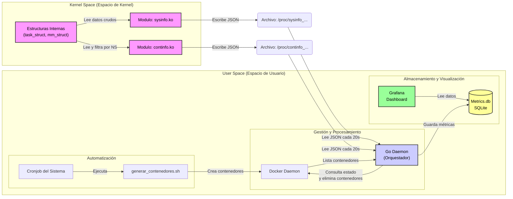

# Manual Técnico - Proyecto 1
## Sistema de Monitoreo de Procesos y Contenedores en Linux

**Universidad San Carlos de Guatemala**  
**Facultad de Ingeniería**  
**Ingeniería en Ciencias y Sistemas**  
**Sistemas Operativos 1**  
**Carnet:** 202300539  
**Nombre:** José Emanuel Monzón Lémus  
**Repositorio:** https://github.com/0520Jose/SO1_P1_202300539

---

## Tabla de Contenidos

1. [Introducción](#introducción)
2. [Arquitectura del Sistema](#arquitectura-del-sistema)
3. [Módulos de Kernel](#módulos-de-kernel)
4. [Daemon en Go](#daemon-en-go)
5. [Scripts de Automatización](#scripts-de-automatización)
6. [Base de Datos SQLite](#base-de-datos-sqlite)
7. [Dashboards en Grafana](#dashboards-en-grafana)
8. [Compilación e Instalación](#compilación-e-instalación)
9. [Decisiones de Diseño](#decisiones-de-diseño)
10. [Problemas Encontrados y Soluciones](#problemas-encontrados-y-soluciones)

---

## Introducción

### Objetivo del Proyecto

Desarrollar un sistema integral de monitoreo que combina módulos de kernel en C con un daemon en Go para la gestión automatizada de contenedores Docker, con visualización en tiempo real mediante Grafana.

### Componentes Principales

1. **Dos módulos de kernel en C:**
   - `sysinfo.ko`: Monitorea procesos del sistema operativo
   - `continfo.ko`: Monitorea procesos de contenedores Docker

2. **Daemon en Go:**
   - Gestión automatizada de contenedores
   - Análisis de métricas en tiempo real
   - Almacenamiento en SQLite

3. **Sistema de automatización:**
   - Cronjob para generación de contenedores
   - Scripts Bash para carga de módulos

4. **Visualización:**
   - Dos dashboards en Grafana
   - Actualización en tiempo real

---

## Arquitectura del Sistema

### Diagrama de Componentes



### Flujo de Datos

1. **Captura:** Módulos de kernel capturan métricas de procesos
2. **Exposición:** Datos expuestos en `/proc` en formato JSON
3. **Lectura:** Daemon Go lee datos cada 20 segundos
4. **Análisis:** Daemon analiza y toma decisiones de gestión
5. **Almacenamiento:** Datos guardados en SQLite
6. **Visualización:** Grafana consulta SQLite y muestra dashboards

---

## Módulos de Kernel

### Organización de Archivos

```
modulo-kernel/
	sysinfo.c          # Módulo para procesos del sistema
	continfo.c         # Módulo para procesos de contenedores
	Makefile           # Script de compilación
	sysinfo.ko         # Módulo compilado (generado)
	continfo.ko        # Módulo compilado (generado)
```

### 1. Módulo sysinfo.ko

#### Propósito
Monitorear todos los procesos del sistema operativo, capturando métricas de rendimiento y uso de recursos.

#### Estructura del Código

**Archivo:** `modulo-kernel/sysinfo.c`

**Headers incluidos:**
```c
#include <linux/module.h>
#include <linux/kernel.h>
#include <linux/init.h>
#include <linux/proc_fs.h>
#include <linux/seq_file.h>
#include <linux/mm.h>
#include <linux/sched.h>
#include <linux/sched/signal.h>
#include <linux/time.h>
```

**Metadata del módulo:**
```c
MODULE_LICENSE("GPL");
MODULE_AUTHOR("Emanuel");
MODULE_DESCRIPTION("Modulo de Informacion del Sistema SO1");
```

#### Funciones Principales

##### `show_sysinfo(struct seq_file *m, void *v)`

**Propósito:** Generar el contenido JSON que se mostrará en `/proc/sysinfo_so1_202300539`.

**Proceso:**

1. **Obtener información de memoria:**
```c
struct sysinfo i;
si_meminfo(&i);

total_ram = (i.totalram * 4);  // Convertir a KB
free_ram = (i.freeram * 4);
used_ram = total_ram - free_ram;
```

2. **Recorrer todos los procesos:**
```c
for_each_process(task) {
    // Procesar cada tarea del sistema
}
```

3. **Calcular RSS (Memoria Física):**
```c
if (task->mm) {
    rss = get_mm_rss(task->mm) << PAGE_SHIFT;
} else {
    rss = 0;  // Proceso del kernel sin memoria de usuario
}
```

4. **Calcular uso de CPU:**
```c
now_ns = ktime_get_ns();
cpu_time_ns = task->utime + task->stime;  // Tiempo en user + kernel
elapsed_time_ns = now_ns - task->start_time;

if (elapsed_time_ns > 0) {
    cpu_usage_percent = div64_u64(cpu_time_ns * 100, elapsed_time_ns);
}
```

5. **Calcular porcentaje de memoria:**
```c
if (total_ram > 0) {
    mem_usage_percent = ((rss / 1024) * 100) / total_ram;
}
```

6. **Calcular VSZ (Memoria Virtual):**
```c
vsz = (task->mm) ? (task->mm->total_vm << (PAGE_SHIFT - 10)) : 0;
```

**Datos capturados:**
- `pid`: PID del proceso
- `name`: Nombre del proceso (`task->comm`)
- `state`: Estado del proceso (`task->__state`)
- `rss`: Resident Set Size - memoria física en KB
- `mem_percent`: Porcentaje de memoria utilizada
- `vsz`: Virtual Size - memoria virtual en KB
- `cpu`: Porcentaje de CPU utilizado

##### `sysinfo_init(void)`

**Propósito:** Inicializar el módulo al cargarlo.

**Proceso:**
```c
static int __init sysinfo_init(void) {
    proc_create("sysinfo_so1_202300539", 0, NULL, &sysinfo_ops);
    printk(KERN_INFO "Modulo sysinfo cargado.\n");
    return 0;
}
```

- Crea la entrada `/proc/sysinfo_so1_202300539`
- Asocia las operaciones de lectura con `show_sysinfo()`
- Registra mensaje en el log del kernel

##### `sysinfo_exit(void)`

**Propósito:** Limpiar recursos al descargar el módulo.

```c
static void __exit sysinfo_exit(void) {
    remove_proc_entry("sysinfo_so1_202300539", NULL);
    printk(KERN_INFO "Modulo sysinfo descargado.\n");
}
```

#### Formato de Salida

**Estructura JSON:**
```json
{
  "total_ram": 8192000,
  "free_ram": 4096000,
  "used_ram": 4096000,
  "processes": [
    {
      "pid": 1234,
      "name": "bash",
      "state": 0,
      "rss": 2048,
      "mem_percent": 1,
      "vsz": 4096,
      "cpu": 5
    }
  ]
}
```

**Estados de proceso:**
- 0: Running
- 1: Sleeping
- 2: Disk Sleep
- 4: Zombie
- 16: Dead

---

### 2. Módulo continfo.ko

#### Propósito
Monitorear específicamente los procesos que pertenecen a contenedores Docker, filtrando por namespace.

#### Diferencias con sysinfo

**Principal diferencia:** Filtrado por namespace para identificar contenedores.

**Código de filtrado:**
```c
struct task_struct *init_task_ptr = &init_task;
bool is_container = false;

if (task->nsproxy && init_task_ptr->nsproxy) {
    if (task->nsproxy->uts_ns != init_task_ptr->nsproxy->uts_ns) {
        is_container = true;
    }
}
```

**Explicación:**
- `init_task`: Primer proceso del sistema (PID 1)
- `nsproxy`: Estructura de namespaces del proceso
- `uts_ns`: UTS namespace (hostname/domainname)
- Si el namespace es diferente al del sistema → es un contenedor

**Datos NO incluidos:**
- `state`: Solo se usa para procesos del sistema

#### Formato de Salida

**Estructura JSON:**
```json
[
  {
    "pid": 5678,
    "name": "stress",
    "rss": 128000,
    "mem_percent": 2,
    "vsz": 256000,
    "cpu": 85
  }
]
```

---

### Compilación de Módulos

#### Makefile

**Archivo:** `modulo-kernel/Makefile`

```makefile
obj-m += sysinfo.o
obj-m += continfo.o

all:
	make -C /lib/modules/$(shell uname -r)/build M=$(PWD) modules

clean:
	make -C /lib/modules/$(shell uname -r)/build M=$(PWD) clean
```

**Explicación:**
- `obj-m`: Indica que son módulos cargables
- `$(shell uname -r)`: Versión actual del kernel
- `M=$(PWD)`: Directorio actual con el código fuente

#### Instrucciones de Compilación

```bash
# 1. Entrar al directorio
cd modulo-kernel

# 2. Limpiar compilaciones anteriores
make clean

# 3. Compilar módulos
make

# 4. Verificar archivos generados
ls -lh *.ko
```

**Salida esperada:**
```
-rw-r--r-- 1 user user 12K continfo.ko
-rw-r--r-- 1 user user 13K sysinfo.ko
```

#### Carga y Descarga de Módulos

**Cargar módulos:**
```bash
sudo insmod sysinfo.ko
sudo insmod continfo.ko
```

**Verificar carga correcta:**
```bash
# Método 1: Ver módulos cargados
lsmod | grep info

# Salida esperada:
# sysinfo                16384  0
# continfo               16384  0

# Método 2: Ver mensajes del kernel
dmesg | tail -n 20

# Salida esperada:
# [12345.678] Modulo sysinfo cargado.
# [12346.789] Modulo continfo cargado.

# Método 3: Verificar archivos /proc
ls -lh /proc/*info_so1*

# Salida esperada:
# -r--r--r-- 1 root root 0 /proc/sysinfo_so1_202300539
# -r--r--r-- 1 root root 0 /proc/continfo_so1_202300539
```

**Descargar módulos:**
```bash
sudo rmmod continfo
sudo rmmod sysinfo

# Verificar descarga
lsmod | grep info
# (no debería mostrar nada)
```

#### Pruebas y Verificación

**1. Leer información del sistema:**
```bash
cat /proc/sysinfo_so1_202300539 | head -50
```

**2. Leer información de contenedores:**
```bash
cat /proc/continfo_so1_202300539
```

**3. Validar formato JSON:**
```bash
cat /proc/sysinfo_so1_202300539 | python3 -m json.tool
```

**4. Contar procesos:**
```bash
cat /proc/sysinfo_so1_202300539 | python3 -c "import sys, json; data = json.load(sys.stdin); print(f'Procesos: {len(data[\"processes\"])}')"
```

**5. Ver procesos de contenedores:**
```bash
cat /proc/continfo_so1_202300539 | python3 -m json.tool | grep -A 6 "stress"
```

#### Dependencias Externas

**Librerías del kernel necesarias:**
- `linux/module.h`: Funciones para módulos cargables
- `linux/kernel.h`: Funciones del kernel
- `linux/proc_fs.h`: Sistema de archivos /proc
- `linux/seq_file.h`: Archivos secuenciales
- `linux/mm.h`: Gestión de memoria
- `linux/sched.h`: Estructuras de procesos
- `linux/sched/signal.h`: Señales de procesos
- `linux/nsproxy.h`: Namespaces
- `linux/pid_namespace.h`: PID namespaces
- `linux/time.h`: Funciones de tiempo

**Verificar headers del kernel:**
```bash
ls /lib/modules/$(uname -r)/build/include/linux/ | grep -E "module|sched|proc_fs"
```

---

## Daemon en Go

### Organización de Archivos

```
go-daemon/
	main.go            # Código principal del daemon
 	go.mod             # Dependencias del proyecto
 	go.sum             # Checksums de dependencias
 	daemon             # Binario compilado (generado)
	metrics.db         # Base de datos SQLite (generado en runtime)
```

### Dependencias

**Archivo:** `go-daemon/go.mod`

```go
module github.com/0520Jose/SO1_P1_202300539

go 1.24.0

require (
	github.com/mattn/go-sqlite3 v1.14.32
	golang.org/x/sys v0.38.0
)
```

**Librerías externas:**
- `github.com/mattn/go-sqlite3`: Driver SQLite para Go
- `golang.org/x/sys`: Funciones de sistema de bajo nivel

### Constantes de Configuración

```go
const SCRIPT_PATH = "../bash/generar_contenedores.sh"  // Script de generación
const PROCS_FILE = "/proc/sysinfo_so1_202300539"       // Archivo de procesos
const CONT_FILE = "/proc/continfo_so1_202300539"       // Archivo de contenedores
const DB_PATH = "./metrics.db"                         // Base de datos SQLite

const MAX_CONTAINERS = 10  // Límite máximo de contenedores
const MIN_CONTAINERS = 5   // Objetivo: 3 low + 2 high
```

### Estructuras de Datos

```go
// Process: Representa un proceso del sistema o contenedor
type Process struct {
	Pid        int    `json:"pid"`         // ID del proceso
	Name       string `json:"name"`        // Nombre del proceso
	State      int    `json:"state"`       // Estado (solo para sysinfo)
	Rss        int64  `json:"rss"`         // Memoria física en KB
	Vsz        int64  `json:"vsz"`         // Memoria virtual en KB
	Cpu        int64  `json:"cpu"`         // Porcentaje de CPU
	MemPercent int64  `json:"mem_percent"` // Porcentaje de memoria
}

// SysInfo: Información completa del sistema desde /proc/sysinfo
type SysInfo struct {
	TotalRam  int64     `json:"total_ram"`  // RAM total en KB
	FreeRam   int64     `json:"free_ram"`   // RAM libre en KB
	UsedRam   int64     `json:"used_ram"`   // RAM usada en KB
	Processes []Process `json:"processes"`  // Lista de procesos
}

// ContainerInfo: Información de un contenedor Docker
type ContainerInfo struct {
	ID       string  // ID del contenedor
	Image    string  // Imagen Docker
	Name     string  // Nombre del contenedor
	RamUsage int64   // Uso de RAM en KB
	CpuUsage int64   // Uso de CPU en porcentaje
	IsLow    bool    // true si es alpine (bajo consumo)
}
```

### Documentación de Funciones

#### 1. `main()`

**Propósito:** Punto de entrada del daemon. Orquesta todo el sistema.

**Flujo de ejecución:**

1. Inicializar base de datos
2. Cargar módulos del kernel mediante script
3. Iniciar contenedor de Grafana
4. Configurar cronjob del sistema
5. Configurar manejador de señales (Ctrl+C)
6. Ejecutar loop infinito cada 20 segundos

**Código:**
```go
func main() {
	// Inicializacion de base de datos
	initDB()
	
	// Inicializacion de modulos del kernel
	loadCmd := exec.Command("bash", "../bash/load_modules.sh")
	loadCmd.Stdout = os.Stdout
	loadCmd.Stderr = os.Stderr
	if err := loadCmd.Run(); err != nil {
		log.Printf("Error: %v", err)
	}

	// Iniciar Grafana
	cmd := exec.Command("docker", "compose", "-f", 
		"../dashboard/docker-compose.yml", "up", "-d")
	cmd.Stdout = os.Stdout
	cmd.Stderr = os.Stderr
	if err := cmd.Run(); err != nil {
		log.Printf("Error Grafana: %v", err)
	} else {
		log.Println("Grafana iniciado correctamente")
	}
	
	// Configurar cronjob
	setupCronjob()

	// Capturar señales de interrupción
	c := make(chan os.Signal, 1)
	signal.Notify(c, os.Interrupt, syscall.SIGTERM)
	go func() {
		<-c
		log.Println("\n\nSaliendo")
		cleanup()
		os.Exit(0)
	}()

	// Loop principal cada 20 segundos
	ticker := time.NewTicker(20 * time.Second)
	defer ticker.Stop()

	deleted := manageContainers()
	readAndSaveMetrics(deleted)

	for range ticker.C {
		deleted := manageContainers()
		readAndSaveMetrics(deleted)
	}
}
```

#### 2. `initDB()`

**Propósito:** Crear la base de datos SQLite y sus tablas si no existen.

**Tablas creadas:**

1. **metrics:** Métricas generales del sistema
2. **container_stats:** Estadísticas de contenedores individuales
3. **process_stats:** Estadísticas de procesos del sistema

**Código:**
```go
func initDB() {
	// Crear base de datos SQLite si no existe
	db, err := sql.Open("sqlite3", DB_PATH)
	if err != nil {
		log.Fatal(err)
	}
	defer db.Close()

	// Tabla para métricas generales
	sqlStmt := `
	CREATE TABLE IF NOT EXISTS metrics (
		id INTEGER PRIMARY KEY AUTOINCREMENT,
		timestamp INTEGER NOT NULL,
		total_ram INTEGER,
		free_ram INTEGER,
		used_ram INTEGER,
		container_count INTEGER,
		process_count INTEGER,
		deleted_count INTEGER
	);`
	db.Exec(sqlStmt)

	// Tabla para estadísticas de contenedores
	sqlStmt2 := `
	CREATE TABLE IF NOT EXISTS container_stats (
		id INTEGER PRIMARY KEY AUTOINCREMENT,
		timestamp INTEGER NOT NULL,
		container_id TEXT,
		container_name TEXT,
		pid INTEGER,
		process_name TEXT,
		ram_usage INTEGER,
		cpu_usage INTEGER
	);`
	db.Exec(sqlStmt2)

	// Tabla para estadísticas de procesos
	sqlStmt3 := `
	CREATE TABLE IF NOT EXISTS process_stats (
		id INTEGER PRIMARY KEY AUTOINCREMENT,
		timestamp INTEGER NOT NULL,
		pid INTEGER,
		name TEXT,
		ram_usage INTEGER,
		cpu_usage INTEGER
	);`
	db.Exec(sqlStmt3)
}
```

**Nota:** Los timestamps se guardan en Unix epoch (milisegundos) para compatibilidad con Grafana.

#### 3. `readAndSaveMetrics(deletedCount int)`

**Propósito:** Leer métricas de `/proc` y almacenarlas en SQLite.

**Parámetros:**
- `deletedCount`: Número de contenedores eliminados en este ciclo

**Proceso:**

1. Leer `/proc/sysinfo_so1_202300539` y deserializar JSON
2. Obtener lista de contenedores Docker activos
3. Leer `/proc/continfo_so1_202300539` y deserializar JSON
4. Mapear procesos del kernel a contenedores Docker
5. Guardar en las 3 tablas de SQLite

**Fragmento clave:**
```go
// Leer sysinfo desde /proc
data, err := ioutil.ReadFile(PROCS_FILE)
var info SysInfo
json.Unmarshal(data, &info)

// Obtener lista de contenedores Docker activos
cmd := exec.Command("docker", "ps", "--format", "{{.Names}}")
output, _ := cmd.Output()

// Mapear procesos a contenedores
containerIndex := 0
for _, proc := range contProcs {
	if strings.Contains(proc.Name, "stress") || 
	   strings.Contains(proc.Name, "sleep") {
		containerName := containerNames[containerIndex]
		// Guardar en BD
		containerIndex++
	}
}
```

#### 4. `manageContainers() int`

**Propósito:** Gestionar contenedores aplicando las restricciones del proyecto.

**Retorna:** Número de contenedores eliminados

**Restricciones aplicadas:**
- Máximo 10 contenedores totales
- Mantener 3 contenedores de bajo consumo (alpine)
- Mantener 2 contenedores de alto consumo (stress)
- Nunca eliminar Grafana

**Algoritmo:**

1. Obtener lista de contenedores Docker
2. Leer métricas del kernel desde `/proc/continfo`
3. Clasificar por tipo (low/high)
4. Verificar límite total (emergencia si >10)
5. Ordenar por RAM (peor rendimiento primero)
6. Eliminar exceso manteniendo los mejores

**Fragmento clave:**
```go
// Ordenar por RAM (mayor consumo primero)
sort.Slice(lowContainers, func(i, j int) bool {
	return lowContainers[i].RamUsage > lowContainers[j].RamUsage
})

// Mantener solo 3 low
if len(lowContainers) > 3 {
	for i := 3; i < len(lowContainers); i++ {
		exec.Command("docker", "stop", lowContainers[i].ID).Run()
		exec.Command("docker", "rm", lowContainers[i].ID).Run()
		totalDeleted++
	}
}
```

**Decisión de diseño:** Se eliminan primero los contenedores con MAYOR consumo de RAM, manteniendo los de mejor rendimiento.

#### 5. `emergencyCleanup(lowContainers, highContainers []ContainerInfo) int`

**Propósito:** Limpieza de emergencia cuando hay más de 10 contenedores.

**Proceso:**
1. Ordenar ambas listas por RAM (peor primero)
2. Eliminar TODO el exceso
3. Mantener exactamente 3 low + 2 high = 5 total

#### 6. `setupCronjob()`

**Propósito:** Configurar cronjob en el sistema operativo.

**Proceso:**

1. Obtener ruta absoluta del script
2. Hacer el script ejecutable (`chmod +x`)
3. Verificar si ya existe en crontab
4. Agregar entrada si no existe

**Código:**
```go
func setupCronjob() {
	scriptPath, err := filepath.Abs(SCRIPT_PATH)
	if err != nil {
		return
	}

	// Asegurarse de que el script es ejecutable
	exec.Command("chmod", "+x", scriptPath).Run()

	// Verificar si ya existe
	checkCmd := exec.Command("bash", "-c", 
		"crontab -l 2>/dev/null | grep -F '"+scriptPath+"'")
	output, _ := checkCmd.Output()

	if len(output) > 0 {
		return
	}

	// Crear entrada
	logPath := filepath.Join(filepath.Dir(scriptPath), "execution.log")
	cronEntry := fmt.Sprintf("* * * * * %s >> %s 2>&1", 
		scriptPath, logPath)

	cmd := exec.Command("bash", "-c", 
		fmt.Sprintf("(crontab -l 2>/dev/null; echo '%s') | crontab -", 
		cronEntry))
	if err := cmd.Run(); err != nil {
		log.Printf("Error configurando cronjob: %v", err)
	} else {
		log.Println("Cronjob configurado exitosamente")
	}
}
```

**Formato del cronjob:**
```
* * * * * /ruta/absoluta/bash/generar_contenedores.sh >> execution.log 2>&1
```

#### 7. `removeCronjob()`

**Propósito:** Eliminar el cronjob del sistema.

**Proceso:**
1. Obtener ruta del script
2. Filtrar la línea del crontab que la contiene
3. Actualizar crontab sin esa línea

#### 8. `cleanup()`

**Propósito:** Limpieza completa al detener el daemon.

**Proceso:**

1. Eliminar cronjob del sistema
2. Verificar eliminación (importante para evitar generación continua)
3. Detener y eliminar todos los contenedores (excepto Grafana)
4. Descargar módulos del kernel
5. Detener Grafana

**Código:**
```go
func cleanup() {
	// Eliminar cronjob
	removeCronjob()
	time.Sleep(2 * time.Second)
	
	// Verificar eliminación del cronjob
	checkCmd := exec.Command("bash", "-c", 
		"crontab -l 2>/dev/null | grep generar_contenedores")
	if output, _ := checkCmd.Output(); len(output) > 0 {
		exec.Command("bash", "-c", "crontab -r").Run()
	} else {
		log.Println("Cronjob eliminado correctamente")
	}

	// Detener y eliminar contenedores Docker
	cmd := exec.Command("docker", "ps", "-a", "--format", "{{.ID}}|{{.Names}}")
	output, _ := cmd.Output()
	lines := strings.Split(string(output), "\n")
	
	stoppedCount := 0
	for _, line := range lines {
		if line == "" {
			continue
		}
		parts := strings.Split(line, "|")
		if len(parts) < 2 {
			continue
		}
		id := parts[0]
		name := parts[1]
		if strings.Contains(name, "grafana") {
			continue
		}
		
		exec.Command("docker", "stop", id).Run()
		exec.Command("docker", "rm", id).Run()
		stoppedCount++
	}
	
	// Descargar módulos del kernel
	exec.Command("sudo", "rmmod", "continfo").Run()
	exec.Command("sudo", "rmmod", "sysinfo").Run()

	// Detener Grafana
	exec.Command("docker", "compose", "-f", 
		"../dashboard/docker-compose.yml", "down").Run()
}
```

### Compilación del Daemon

```bash
# Entrar al directorio
cd go-daemon

# Descargar dependencias
go mod download

# Compilar
go build -o daemon main.go

# Verificar binario
ls -lh daemon
```

---

## Scripts de Automatización
### Organización de Archivos

```
proyecto-1/bash/
	generar_contenedores.sh  # Script para crear tráfico/contenedores
	load_modules.sh          # Script para compilar y cargar módulos
```

### 1. Script generar_contenedores.sh

Propósito: Simular actividad en el sistema creando contenedores de manera aleatoria. Este script es ejecutado automáticamente por el cronjob configurado por el Daemon.

#### Funcionamiento:

1. Genera un número aleatorio de contenedores (entre 1 y 5).

2. Selecciona aleatoriamente entre dos tipos de imágenes:

	- Low consumption: alpine (ejecuta un sleep).

	- High consumption: stress (ejecuta pruebas de estrés de memoria/cpu).

3. Asigna nombres únicos basados en la fecha y hora para evitar colisiones.

##### Comando clave:

```Bash

docker run -d --name "container_$TIMESTAMP" $IMAGE $COMMAND
```
### 2. Script load_modules.sh
Propósito: Automatizar la limpieza, compilación, asignación de permisos y carga de los módulos del kernel en un solo paso.

#### Flujo de ejecución:

1. Limpieza: Ejecuta make clean en la carpeta modulo-kernel para eliminar binarios viejos.

2. Compilación: Ejecuta make para generar los nuevos archivos .ko.

3. Carga: Utiliza insmod para insertar sysinfo.ko y continfo.ko.

4. Permisos: Ejecuta chmod 777 sobre los archivos generados en /proc/ para asegurar que el Daemon (y cualquier usuario) pueda leerlos sin sudo constante.

### Decisiones de Diseño
#### 1. Uso del Sistema de Archivos /proc
**Decisión**: Se optó por utilizar proc_create y seq_file para comunicar el Kernel con el espacio de usuario.

- **Razón**: Es el estándar en Linux para exponer métricas del kernel. Permite depurar fácilmente usando comandos simples como cat sin necesitar herramientas especiales. Además, el formato JSON se genera directamente en C, simplificando el parsing en el Daemon de Go.

#### 2. Filtrado por Namespaces en el Kernel
**Decisión**: Detectar contenedores comparando el uts_ns (Namespace UNIX Timesharing) del proceso actual contra el init_task (PID 1).

- **Razón**: Docker aísla procesos utilizando namespaces. Si el namespace de un proceso difiere del proceso init del sistema host, se puede garantizar que ese proceso está "contenerizado". Esto es más eficiente que consultar al demonio de Docker desde C.

#### 3. Arquitectura del Daemon en Go
**Decisión**: Utilizar Go con la librería estándar os/exec y database/sql.

- **Razón**: Go ofrece un manejo de concurrencia nativo superior a C/C++ y Python para este tipo de tareas. Su tipado estático ayuda a mapear el JSON del kernel a estructuras (structs) de manera segura, evitando errores de memoria comunes en el manejo de cadenas.

#### 4. Persistencia en SQLite
**Decisión**: Usar una base de datos embebida (SQLite) en lugar de una cliente-servidor (MySQL/PostgreSQL).

- **Razón**: El proyecto requiere portabilidad y simplicidad. Un archivo local .db elimina la necesidad de configurar servidores de base de datos adicionales, reduciendo la carga del sistema y facilitando la calificación y despliegue del proyecto.

## Problemas Encontrados y Soluciones
- **Problema 1:** Permisos de Lectura en /proc
Descripción: Al principio, el Daemon en Go fallaba al intentar leer /proc/sysinfo_so1... porque por defecto los archivos en /proc creados por módulos pertenecen a root.

	- **Solución:** Se implementó en el script load_modules.sh un cambio explícito de permisos (chmod 666 o 777) inmediatamente después de cargar el módulo. Además, se configuró el módulo para definir permisos de lectura globales en su creación (0644).

- **Problema 2:** "Zombie" Processes al detener Contenedores
Descripción: Al detener contenedores rápidamente, quedaban procesos en estado "Zombie" o "Defunct" que falseaban el conteo de procesos activos.

	- **Solución:** Se ajustó la lógica del Daemon para utilizar docker rm -f (forzado) y esperar brevemente (time.Sleep) entre operaciones de limpieza para dar tiempo al kernel de liberar los descriptores de proceso.

- **Problema 3:** Compatibilidad de Headers del Kernel
Descripción: Al mover el código de una máquina a otra, la compilación fallaba porque la versión del kernel era distinta (ej. 5.15 vs 6.2).

	- **Solución:** Se parametrizó el Makefile utilizando $(shell uname -r) para buscar dinámicamente la carpeta de headers correcta de la máquina actual, haciendo el código portable entre distintas distribuciones de Linux.

- **Problema 4:** Parsing de JSON en C
Descripción: Generar JSON válido en C es propenso a errores (comas extra al final de listas).
	- **Solución:** Se implementó una lógica de "flag" (bool first = true) dentro del bucle for_each_process. Si no es el primer elemento, se imprime una coma antes del siguiente objeto, asegurando que el último elemento no tenga una coma colgante que rompa el parser de Go.