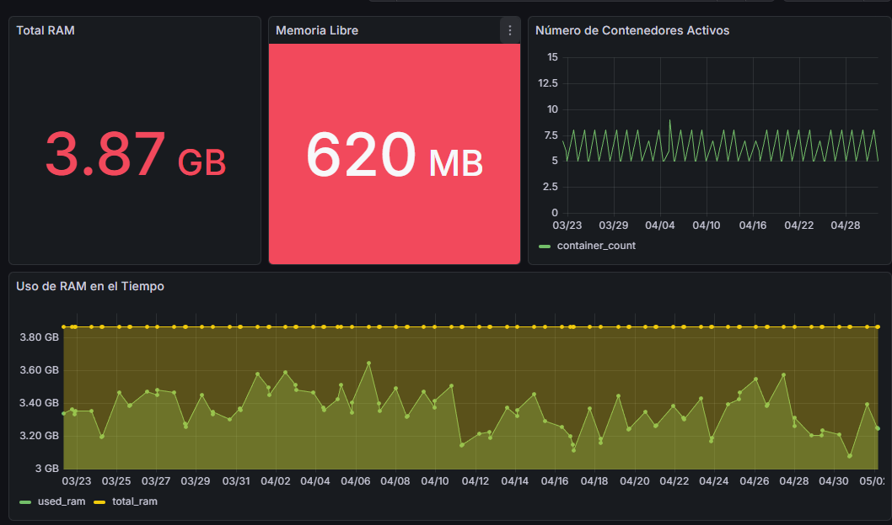
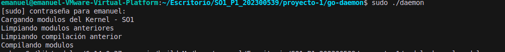
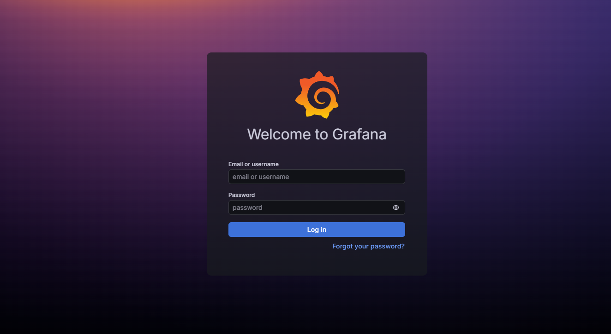
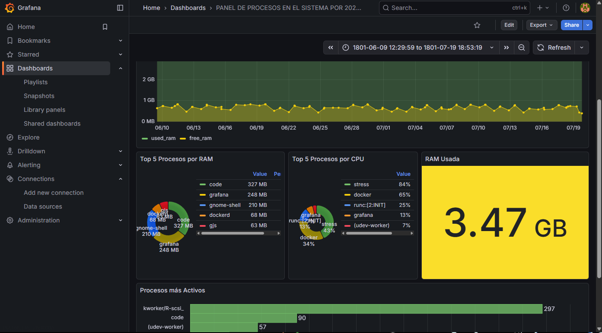
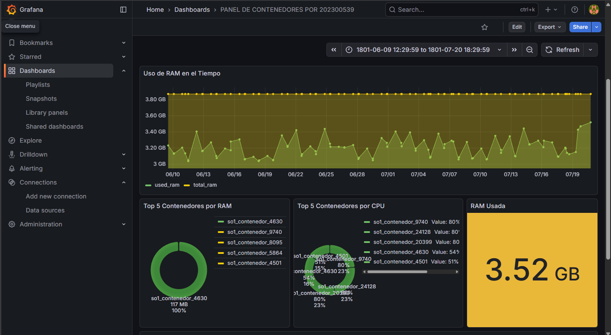
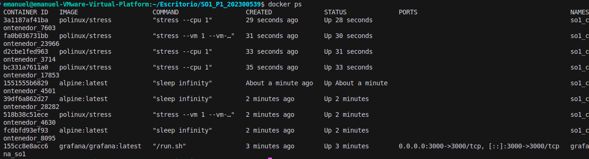

# Manual de Usuario

## Sistema de Monitoreo de Recursos y Gestión de Contenedores

**Universidad de San Carlos de Guatemala**  
**Facultad de Ingeniería**  
**Sistemas Operativos 1**  
**Nombre:** José Emanuel Monzón Lémus  
**Carnet:** 202300539

---

## 1. Introducción

El **Sistema de Monitoreo SO1** es una herramienta diseñada para la visualización en tiempo real del comportamiento de la memoria RAM y el procesador (CPU) del servidor, mediante la gestión automática de contenedores Docker que simulan carga de trabajo en el sistema.

El sistema opera de forma autónoma, creando, supervisando y eliminando contenedores de manera automática para garantizar un uso eficiente de los recursos disponibles, sin requerir intervención manual constante.

---

## 2. Arquitectura del Sistema

El sistema se compone de tres capas principales que trabajan de forma integrada:

### Módulos del Kernel (Kernel Space)
Componentes instalados en el núcleo del sistema operativo que realizan la lectura continua de las métricas de uso de memoria y CPU.

### Daemon de Gestión (Implementado en Go)
Programa principal encargado de la toma de decisiones basadas en las métricas recolectadas. Sus funciones principales incluyen:
- Permitir la creación de contenedores adicionales cuando existe disponibilidad de memoria.
- Eliminar contenedores que consumen recursos excesivos cuando el sistema se encuentra sobrecargado.

### Interfaz de Visualización (Grafana)
Panel web que proporciona la representación gráfica de las métricas recolectadas mediante visualizaciones intuitivas y en tiempo real.



---

## 3. Guía de Instalación

### Requisitos del Sistema

El sistema requiere las siguientes especificaciones mínimas:

- **Sistema Operativo:** Distribución Linux (Ubuntu 20.04/22.04 o Debian recomendado)
- **Conectividad:** Acceso a Internet para descarga de paquetes y contenedores
- **Privilegios:** Acceso administrativo mediante `sudo` o cuenta root

**Dependencias de Software:**
- `git` - Sistema de control de versiones
- `docker` y `docker compose` - Plataforma de contenedores
- `go` - Lenguaje de programación (versión 1.20 o superior)
- `make` y `gcc` - Herramientas de compilación

### Procedimiento de Instalación

#### Paso 1: Obtención del código fuente

Ejecutar los siguientes comandos en terminal para clonar el repositorio:
```bash
git clone https://github.com/0520Jose/SO1_P1_202300539
cd SO1_P1_202300539/proyecto-1
```

#### Paso 2: Configuración de permisos

Asignar permisos de ejecución a los scripts del sistema:
```bash
chmod +x bash/*.sh
```

#### Paso 3: Compilación del daemon

Generar el ejecutable del daemon mediante los siguientes comandos:
```bash
cd go-daemon
go mod tidy
go build -o daemon main.go
```

---

## 4. Instrucciones de Operación

### Inicio del Sistema

Para iniciar el sistema, ejecutar el siguiente comando desde el directorio `go-daemon`:
```bash
sudo ./daemon
```

Este comando realizará automáticamente las siguientes operaciones:
- Carga de los módulos del kernel
- Inicialización de la base de datos
- Configuración del sistema de visualización



**Nota:** La terminal debe permanecer abierta durante la operación del sistema. El cierre de la terminal resultará en la detención del servicio.

### Verificación de Funcionamiento

El sistema generará mensajes de estado cada 20 segundos, indicando:
- Lectura exitosa de métricas
- Número de contenedores eliminados
- Uso total de RAM

Estos mensajes confirman la operación correcta del sistema.

---

## 5. Acceso al Panel de Visualización

### Acceso a Grafana

Para acceder a la interfaz de visualización:

1. Abrir un navegador web
2. Ingresar la siguiente URL en la barra de direcciones:
```
http://localhost:3000
```



### Credenciales de Acceso

Las credenciales predeterminadas son:

- **Usuario:** `admin`
- **Contraseña:** `admin`

El sistema puede solicitar el cambio de contraseña en el primer acceso. Es posible omitir este paso mediante la opción "Skip".

### Paneles de Visualización

Los dashboards disponibles se encuentran en la sección **Dashboards** (ícono de cuatro cuadros en el panel lateral). Se han configurado dos paneles principales:

#### 1. Monitor de Sistema

- **Medidor de CPU:** Indicador tipo gauge que muestra el porcentaje de utilización del procesador. Los valores elevados se representan en color rojo, indicando carga máxima.
- **Historial de RAM:** Gráfico de series temporales que muestra la evolución del uso de memoria.



#### 2. Monitor de Contenedores

- **Lista de Procesos:** Registro de contenedores activos con nomenclatura generada automáticamente (ej. `sleep_...`, `stress_...`).
- **Consumo Individual:** Gráficos de barras que indican el consumo de memoria de cada contenedor.



---

## 6. Casos de Uso

### Caso A: Observación de la Gestión Automática

Para observar el comportamiento automático del sistema:

1. Mantener el dashboard abierto en el navegador
2. Esperar entre 1 y 2 minutos

**Resultado esperado:** Las gráficas de RAM mostrarán incrementos (indicando creación de contenedores) seguidos de decrementos o estabilización (indicando eliminación de contenedores para liberación de recursos).

### Caso B: Verificación mediante CLI

Para confirmar la creación de contenedores mediante línea de comandos:

1. Abrir una segunda terminal
2. Ejecutar el siguiente comando:
```bash
docker ps
```

**Resultado esperado:** Se desplegará una lista de contenedores activos con tiempos de creación recientes. La ejecución repetida del comando mostrará variaciones en la lista.



### Caso C: Detención del Sistema

Para detener el sistema de forma ordenada:

1. Ubicar la terminal donde se ejecuta `sudo ./daemon`
2. Presionar `Ctrl + C`

**Resultado:** El sistema ejecutará la secuencia de limpieza automática, que incluye:
- Detención del cronjob
- Eliminación de todos los contenedores activos
- Descarga de los módulos del kernel

---

## 7. Resolución de Problemas

| Problema | Causa Probable | Solución |
|----------|----------------|----------|
| Error: "Permission denied" | Ejecución sin privilegios administrativos | Ejecutar el comando con `sudo`: `sudo ./daemon` |
| Grafana inaccesible desde navegador | Servicio Docker detenido o puerto ocupado | Verificar estado de Docker: `sudo systemctl start docker` |
| Gráficas sin actualización | Daemon detenido o terminal cerrada | Verificar estado del proceso en terminal e reiniciar si es necesario |
| Ausencia de contenedores en `docker ps` | Cronjob pendiente de ejecución | Esperar al menos 60 segundos tras el inicio del sistema para la primera ejecución del generador de carga |

---